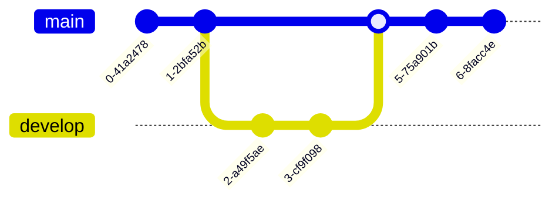

# Heading 1

# test file

## fenced code block

```python
def fizzbuzz(n):
    if n % 3 == 0 and n % 5 == 0:
        return "FizzBuzz"
    elif n % 3 == 0:
        return "Fizz"
    elif n % 5 == 0:
        return "Buzz"
    else:
        return n
```

## mermaid diagram


